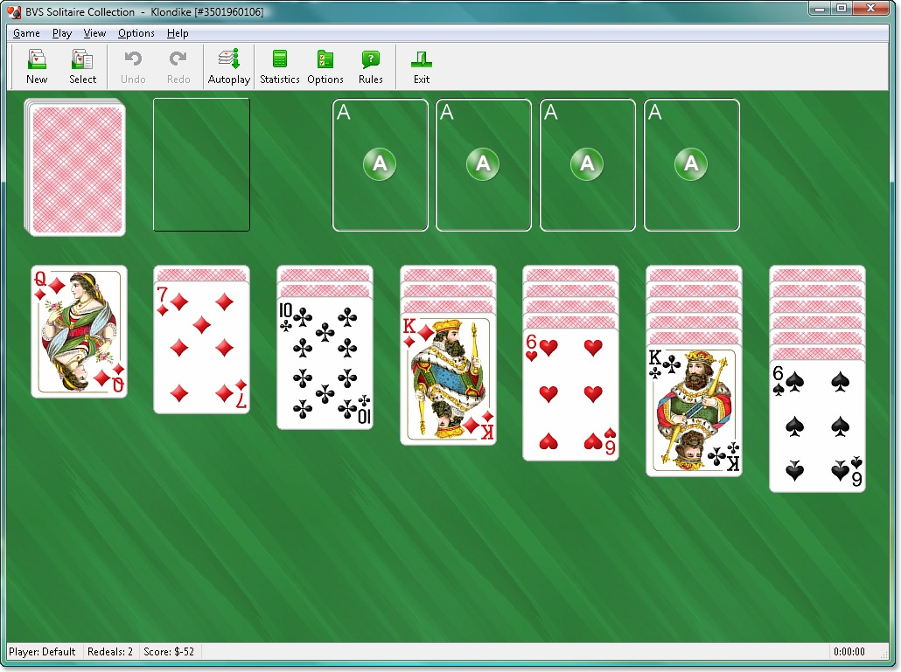

# Kata20: Klondike

Experiment with different heuristics for playing the solitaire game Klondike.

The solitaire game Klondike is probably the most widely played in the world (particularly if you’re a Window’s user, where it has been available since Windows 3.1). It’s a simple game.

Cards are dealt face down onto the seven piles in the tableau. The first pile receives one card, the next two, up to the seventh pile, which not surprisingly has seven cards initially. The top card on each pile is turned face-up, and the undealt cards are placed on the Stock pile, all face down. Here’s a picture of the game (52kb) if you haven’t seen it before.

From www.bvssolitaire.com

The idea is to build up four piles of cards in their suits on the foundation area (one pile for the clubs, one for the diamonds, and so on). The piles must start with the ace and end with the king.

The available moves (in no particular order) are:

* If the Stock becomes empty, turn the entire discard pile over and make it the new Stock.
* Turn over the top card of the Stock and place it face-up on the Discard pile.
* Move a card from the tableau or discard pile to one of the foundation piles. If the foundation pile is empty, only an Ace can be placed there, otherwise only the next highest card in the appropriate suit can be placed (so if a foundation pile is currently showing a four of hearts, only the five of hearts may be placed there).
* Move the top card of the discard pile to one of the tableau piles. This card must be one less in rank and opposite in color to the card at the top of the destination tableau.
* Move one or more cards from one tableau pile to another. If multiple cards are moved, they must be a sequence ascending in rank and alternating in color. The card moved (or the top of the sequence moved) must be one less in rank and opposite in color to the card at the top of the destination tableau. If the move leaves a face-down card to the top of the original pile, turn it over.
* If a move leaves a tableau pile empty, an exposed King at the top of a tableau or discard pile, or a sequence starting with a King on a tableau pile, may be moved to it.

So, in the game pictured about, a possible first set of moves might be:

* Move the Queen of Diamonds onto the King of Clubs.
* This leaves the first pile in the tableau empty, so the combined King/Queen can be moved to it, and the card originally beneath the King is turned over.
* The Six of Spades can be moved on to the Seven of Diamonds, and the card beneath the six revealed.
* The top card of the stoke can be turned over and placed on the discard pile.

The game is won when all cards are moved to the foundation, and lost when the only remaining moves form an endless loop.

The game is simple to play, but the strategy isn’t immediately obvious. For example, is it always a good idea to move a card from the tableau to the foundation, or is it sometimes better to leave it there to give yourself something to build down on? Is it a good idea to make a move which leaves a tableau pile empty if you don’t immediately have a King to move into the gap? If you have two possible moves which will result in exposing a new tableau card, should you expose the one on the longest or shortest tableau?

This kata is in two parts.

* Come up with an infrastructure so you can have the computer deal and play games of Klondike.
* Use that infrastructure to experiment with strategies to see if you can increase the number of times you win (perhaps you could tabulate the number of times the machine wins a random set of 1,000 games for each strategy you try).

## Objectives

At one level, this is an exercise in design—how can the basic game be modeled in code? Where should the validation of moves be located (in the cards, in the various piles, in some kind of game overseer, or …)? How can we detect that we’ve lost?

Once the basic game is in place, it becomes an exercise in imagination: what strategies can be applied, and how do various sub-strategies interact?

Originally posted by Dave Thomas (@PragDave) Dec 10th, 2013 
